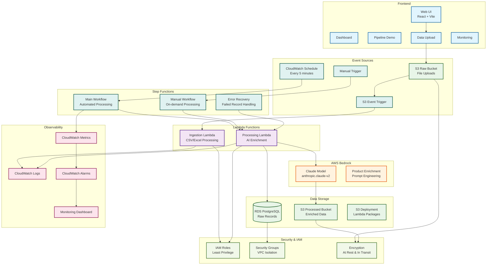

# AI-Powered Product Catalog Ingestion Pipeline Architecture

## Mermaid Architecture Diagram



## ASCII Architecture Diagram

```
┌─────────────────────────────────────────────────────────────────────────────┐
│                           FRONTEND LAYER                                    │
│  ┌─────────────┐ ┌─────────────┐ ┌─────────────┐ ┌─────────────┐         │
│  │   Dashboard │ │ Pipeline Demo│ │ Data Upload  │ │  Monitoring  │         │
│  └─────────────┘ └─────────────┘ └─────────────┘ └─────────────┘         │
└─────────────────────────────────────────────────────────────────────────────┘
                                        │
                                        ▼
┌─────────────────────────────────────────────────────────────────────────────┐
│                          EVENT TRIGGER LAYER                                │
│  ┌─────────────┐ ┌─────────────┐ ┌─────────────┐ ┌─────────────┐         │
│  │  S3 Raw     │ │ S3 Event    │ │ CloudWatch  │ │ Manual       │         │
│  │   Bucket    │ │   Trigger    │ │   Schedule   │ │   Trigger    │         │
│  └─────────────┘ └─────────────┘ └─────────────┘ └─────────────┘         │
└─────────────────────────────────────────────────────────────────────────────┘
                                        │
                                        ▼
┌─────────────────────────────────────────────────────────────────────────────┐
│                        STEP FUNCTIONS ORCHESTRATION                         │
│  ┌─────────────┐ ┌─────────────┐ ┌─────────────┐                         │
│  │ Main Workflow│ │Manual Workflow│ │Error Recovery│                         │
│  └─────────────┘ └─────────────┘ └─────────────┘                         │
└─────────────────────────────────────────────────────────────────────────────┘
                                        │
                                        ▼
┌─────────────────────────────────────────────────────────────────────────────┐
│                          LAMBDA COMPUTE LAYER                               │
│  ┌─────────────┐ ┌─────────────┐                                         │
│  │ Ingestion    │ │ Processing   │                                         │
│  │   Lambda     │ │   Lambda     │                                         │
│  └─────────────┘ └─────────────┘                                         │
└─────────────────────────────────────────────────────────────────────────────┘
                                        │
                                        ▼
┌─────────────────────────────────────────────────────────────────────────────┐
│                            AWS BEDROCK AI LAYER                               │
│  ┌─────────────┐ ┌─────────────┐                                         │
│  │ Claude Model │ │ Product      │                                         │
│  │ (AI Service) │ │ Enrichment   │                                         │
│  └─────────────┘ └─────────────┘                                         │
└─────────────────────────────────────────────────────────────────────────────┘
                                        │
                                        ▼
┌─────────────────────────────────────────────────────────────────────────────┐
│                            DATA STORAGE LAYER                                  │
│  ┌─────────────┐ ┌─────────────┐ ┌─────────────┐                         │
│  │  RDS         │ │ S3 Processed │ │ S3 Deployment│                         │
│  │ PostgreSQL   │ │   Bucket     │ │   Bucket     │                         │
│  └─────────────┘ └─────────────┘ └─────────────┘                         │
└─────────────────────────────────────────────────────────────────────────────┘
                                        │
                                        ▼
┌─────────────────────────────────────────────────────────────────────────────┐
│                         MONITORING & OBSERVABILITY                              │
│  ┌─────────────┐ ┌─────────────┐ ┌─────────────┐                         │
│  │CloudWatch   │ │CloudWatch   │ │  Monitoring  │                         │
│  │    Logs     │ │   Metrics    │ │  Dashboard   │                         │
│  └─────────────┘ └─────────────┘ └─────────────┘                         │
└─────────────────────────────────────────────────────────────────────────────┘
```

## Data Flow Overview

### 1. File Upload Flow
```
User → Web UI → S3 Raw Bucket → S3 Event → Ingestion Lambda → RDS PostgreSQL
```

### 2. Automated Processing Flow
```
CloudWatch Schedule → Step Functions → Processing Lambda → Bedrock Claude → S3 Processed
```

### 3. Manual Processing Flow
```
User → Web UI → Manual Trigger → Step Functions → Processing Lambda → Bedrock Claude
```

### 4. Error Recovery Flow
```
Failed Records → Error Recovery Workflow → Retry Logic → Escalation
```

## Technology Stack

### Frontend
- **React 18** - Modern UI framework
- **Vite** - Fast development tool
- **Tailwind CSS** - Utility-first styling
- **Recharts** - Data visualization

### Backend
- **AWS Lambda** - Serverless compute
- **AWS Step Functions** - Orchestration
- **AWS Bedrock** - AI/ML services
- **Amazon RDS** - PostgreSQL database
- **Amazon S3** - Object storage

### Infrastructure
- **Terraform** - Infrastructure as Code
- **AWS CloudWatch** - Monitoring
- **AWS IAM** - Security management
- **AWS VPC** - Network isolation

## Security Architecture

### Data Protection
- **Encryption at Rest**: All data encrypted in S3 and RDS
- **Encryption in Transit**: TLS for all data transfers
- **Access Control**: IAM roles with least privilege
- **VPC Isolation**: Database in private subnets

### Compliance
- **Data Privacy**: No PII stored in logs
- **Audit Trail**: CloudTrail enabled
- **Network Security**: Security groups and NACLs
- **Secrets Management**: AWS Secrets Manager

## Scalability Features

### Horizontal Scaling
- **Lambda Auto-scaling**: Concurrency limits
- **Step Functions**: Parallel processing
- **S3**: Unlimited storage capacity
- **RDS**: Read replicas for analytics

### Performance Optimization
- **Batch Processing**: Efficient API usage
- **Caching**: Frequently accessed data
- **Connection Pooling**: Database optimization
- **CDN**: Static asset delivery

## Monitoring & Observability

### Metrics Collection
- **Lambda Metrics**: Invocations, duration, errors
- **Step Functions**: Execution success/failure
- **Bedrock API**: Call volume and latency
- **Database**: Performance and connections

### Alerting
- **Error Rates**: High error thresholds
- **Performance**: Slow processing alerts
- **Capacity**: Resource utilization
- **Business**: Processing volume alerts

## Cost Optimization

### Resource Efficiency
- **Serverless**: Pay-per-use pricing
- **Auto-scaling**: Right-sizing resources
- **S3 Tiers**: Intelligent storage classes
- **Lambda Memory**: Optimized configurations

### Cost Controls
- **Budgets**: AWS Budgets and alerts
- **Tagging**: Cost allocation
- **Reserved Capacity**: For predictable workloads
- **Data Lifecycle**: Automated data retention
